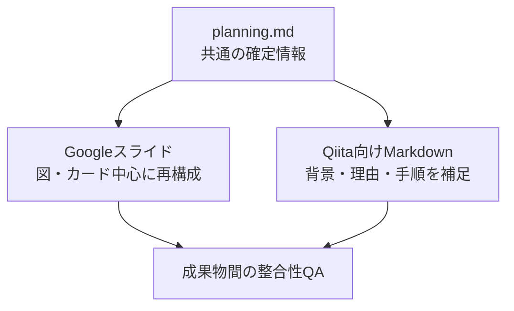

# AI Document Workflow

> AIとのドキュメント作成を、単発の生成から再利用できるプロセスへ。

AI Document Workflowは、ChatGPTなどのAIを使った資料・記事作成において、**事実性・可読性・保守性を安定させるためのワークフロー**です。

文章や構成を生成するだけでなく、案件ごとの`planning.md`を基準資料として、情報整理、設計、レビュー、形式固有のQA、最終承認までを一つの流れとして管理します。

## Background

社内SNS向けの資料を作成した際に、「ドキュメント作成をAIで仕組み化し、毎回の手作業を減らせないか」と考えたことをきっかけに作成したワークフローです。

`planning.md`を基準資料として、情報整理、構成設計、成果物作成、内容レビュー、レイアウトQA、最終確認までの工程を標準化しています。GoogleスライドやQiita向けMarkdownなど、複数形式の成果物にも対応します。

今回の検証ではChatGPT Plusを利用し、Googleスライドの作成・編集にはChatGPTのGoogle Drive連携を使用しました。利用可能な機能や必要なプランは、環境や時期によって異なる場合があります。

## このリポジトリで伝えたいこと

AIによるドキュメント作成では、良いプロンプトだけでは品質が安定しません。

実際の資料作成では、次のような問題が起こります。

- 確定済みの数値や日付が誤って書き換わる
- ユーザーが求めていない一般論が追加される
- 決定事項がチャット履歴へ散らばる
- スライドの文字が図形からはみ出す
- 修正した結果、別の場所が崩れる
- どこまで確認すれば完成なのか分からなくなる
- GoogleスライドとQiita記事で内容が食い違う

本ワークフローでは、これらを個別の注意力だけに頼らず、工程と確認基準で防ぎます。

## Features

- **`planning.md`を基準資料として使用**  
  目的、読者、確定情報、構成、QA、未解決事項、完成条件を一か所へ集約します。

- **内容レビューと形式固有QAを分離**  
  事実や構成の確認と、スライドのレイアウトやMarkdownの表示確認を別工程として扱います。

- **修正後の二次影響を確認**  
  変更箇所だけでなく、周辺の図形、改行、リンク、数式、成果物間の同期まで確認します。

- **複数形式へ展開可能**  
  同じ確定情報を基に、Googleスライド、Qiita向けMarkdownなどへ、各形式に合わせて再構成します。

- **人が最終判断を行う**  
  AIが提案・作成・QAを担当し、人が事実確認、採用判断、最終承認を担当します。

## Design Philosophy

このワークフローは、AIにすべてを任せるためのものではありません。

重視しているのは、次の4点です。

1. **確定情報をチャットの外へ残す**
2. **作成と確認を別の工程として管理する**
3. **AIの出力を、そのまま事実として扱わない**
4. **成果物だけでなく、再利用できる進め方を資産にする**

## Workflow


複数の成果物を作る場合は、主成果物を完成させた後に派生成果物を作成し、最後に成果物間の整合性を確認します。



## Repository Structure

```text
ai-document-workflow/
├── README.md
├── templates/
│   ├── planning-template.md
│   ├── project-definition-template.md
│   └── review-checklist.md
└── examples/
    └── aws-saa/
        ├── planning.md
        └── qiita-article.md
```

### 各ファイルの役割

| ファイル | 役割 |
|---|---|
| `README.md` | ワークフローの考え方、標準工程、使い方を説明するメインドキュメント |
| `templates/project-definition-template.md` | 作業開始前に、テーマ・目的・読者・成果物・制約を整理する入力シート |
| `templates/planning-template.md` | 案件ごとの確定情報、構成、進捗、QA、完成条件を管理するテンプレート |
| `templates/review-checklist.md` | 内容、形式、成果物間の整合性、最終確認に使用するチェックリスト |
| `examples/aws-saa/planning.md` | 実案件を公開用に匿名化・簡略化した`planning.md`の例 |
| `examples/aws-saa/qiita-article.md` | 完成済みスライドからQiita向けへ再構成したMarkdownの例 |

## Quick Start

### 1. 案件を定義する

`templates/project-definition-template.md`を複製し、最低限、次を記入します。

- テーマと背景
- 作成する成果物
- 想定読者
- 利用場面
- 参考資料
- 掲載しない情報
- 完成条件

### 2. planning.mdを作成する

`templates/planning-template.md`を案件フォルダへコピーし、ファイル名を`planning.md`へ変更します。

```text
[案件名]/
├── planning.md
├── 主成果物
└── 派生成果物
```

案件フォルダ自体を管理単位とし、`planning.md`と各成果物は原則として同じ階層へ置きます。

### 3. AIへ依頼する

```text
AI Document Workflowに従って、新しい案件を開始してください。

テーマ：［テーマ］
成果物：［Googleスライド／Qiita向けMarkdown／複数指定］
目的：［目的］
想定読者：［読者］
参照資料：［ファイルやURL］

project-definition-templateの内容を確認し、
planning-templateを基にplanning.mdを作成してください。
まずは情報整理と構成設計まで進め、
planning.mdのレビュー後に成果物を作成してください。
```

### 4. レビューする

初稿は全体を一度成立させてから、次の順序で確認します。

1. 内容レビュー
2. 形式固有QA
3. 修正後の二次影響確認
4. `planning.md`との同期確認
5. ユーザー最終承認

## Review Model

### 内容レビュー

- 目的と読者に合っているか
- 事実、数値、日付、固有名詞が正しいか
- 各ページ・各章の役割が明確か
- 不要な一般論や制作過程の説明がないか
- 中心メッセージにつながる構成か

### GoogleスライドのQA

- 文字や図形が表示領域からはみ出していないか
- 助詞や語尾だけの不自然な改行がないか
- カードの幅、高さ、間隔が揃っているか
- 線や矢印が図形へ不自然に重なっていないか
- 修正後に別の要素が崩れていないか
- 全ページをサムネイルまたはPDFで確認したか

### Qiita向けMarkdownのQA

- 本文をQiitaエディタへそのまま貼り付けられるか
- タイトル案とタグ候補をHTMLコメントへ記録しているか
- 見出し、表、コードブロック、リンクが成立しているか
- 個人情報、社内情報、限定URLが残っていないか
- 本人の体験と外部仕様を区別しているか
- Qiitaへの投稿や下書き登録を自動で行っていないか

### 複数成果物の整合性QA

- 数値、日付、固有名詞が一致しているか
- 用語と中心メッセージが一致しているか
- 一方で削除した情報が、もう一方へ不自然に残っていないか
- 各形式に合わせて情報量と構成を再編集しているか

## Example: AWS SAA

このワークフローは、AWS Certified Solutions Architect - Associateの合格体験記を作成する過程から生まれました。

最初にGoogleスライドを作成し、その後、同じ`planning.md`を基準としてQiita向けMarkdownへ展開しました。

実例では、次の改善を行っています。

- 未確認の模試スコアを掲載しない
- 数値、日付、教材評価を`planning.md`へ集約する
- 内容レビューとレイアウトQAを分ける
- 文字はみ出し、不自然な改行、図形の重なりを確認する
- スライドの文字起こしではなく、Qiita読者向けに背景と判断理由を補う
- 社内向けの所属・氏名・Drive URLを公開例から除外する

実例は[`examples/aws-saa`](examples/aws-saa)を参照してください。

## Supported Outputs

実際に作成・検証した形式：

- Googleスライド
- Qiita向けMarkdown

テンプレート上で扱える形式：

- Googleドキュメント
- Googleスプレッドシート
- その他、形式固有の完成条件とQAを定義できる成果物

## Status Report Format

作業中は、AIが次の形式で現在地を報告します。

```text
現在の工程：［工程］
完成度目安：［目安］
今回の作業：［実施内容］
残りの工程：［残工程］
確認できていないこと：［なし／内容］
```

完成度は厳密な進捗率ではなく、現在地と残作業を共有するための目安として使用します。

## Limitations

- AIの出力内容が自動的に正しいとは限りません
- 本人しか分からない事実は、本人による確認が必要です
- 外部仕様、制度、料金、製品情報は最新の一次情報による確認が必要です
- Google DriveやChatGPTの連携機能は、プランや利用環境によって異なります
- Qiitaへの公開投稿はワークフローの対象外です
- 視覚確認を実施できない場合は、レイアウト確認済みと扱いません

## Roadmap

- [x] Googleスライドの作成フロー
- [x] Qiita向けMarkdownへの再構成
- [x] 複数成果物の整合性QA
- [x] 公開用テンプレートと実例の整理
- [ ] Custom GPTによる作成担当・レビュー担当の分離
- [ ] GitHub上での追加実例
- [ ] ドキュメント・スプレッドシートの実例追加
- [ ] 外部オーケストレーターによるレビュー反復の自動化
